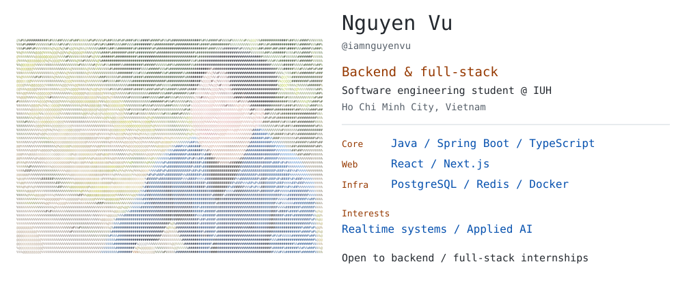

<!-- profile-art:start -->
<picture>
  <source media="(max-width: 600px) and (prefers-color-scheme: dark)" srcset="assets/profile/day-dark-mobile.svg">
  <source media="(max-width: 600px)" srcset="assets/profile/day-light-mobile.svg">
  <source media="(prefers-color-scheme: dark)" srcset="assets/profile/day-dark.svg">
  
</picture>
<!-- profile-art:end -->

<samp>

[portfolio](https://iamnguyenvu.github.io/portfolio/) / [linkedin](https://linkedin.com/in/iamnguyenvu) / [email](mailto:iamnguyenvu.gm@gmail.com)

</samp>

<samp>GitHub activity</samp>

<picture>
  <source media="(prefers-color-scheme: dark)" srcset="https://github-readme-stats.vercel.app/api?username=iamnguyenvu&amp;show_icons=true&amp;hide_border=true&amp;hide_rank=true&amp;card_width=467&amp;hide_title=true&amp;disable_animations=true&amp;bg_color=0d1117&amp;title_color=ffa657&amp;icon_color=ffa657&amp;text_color=a5d6ff">
  
</picture>

<samp>Contributions</samp>

<picture>
  <source media="(prefers-color-scheme: dark)" srcset="assets/activity/snake-dark.svg">
  
</picture>
